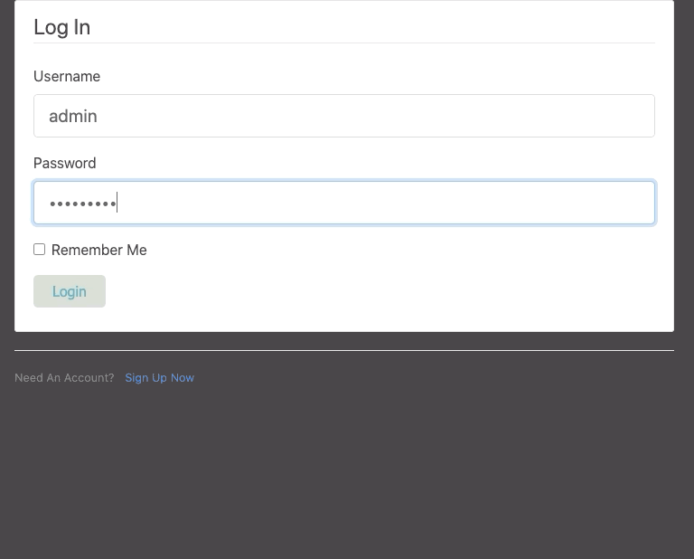
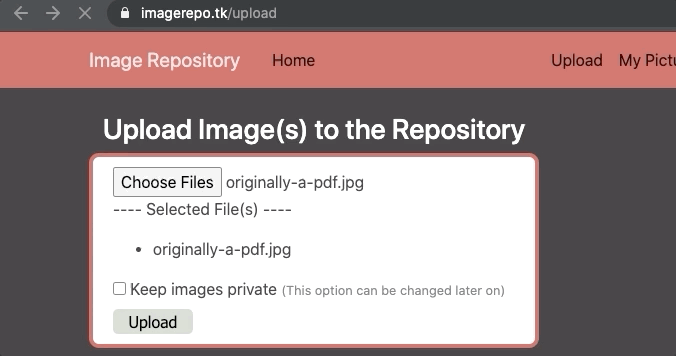

# Image Repository 
This project creates a web application using the Flask framework. It allows users to create accounts, upload and delete their photos, and view other user's submission's on the home page. 

## Demo
To demo this project, visit <del>www.imagerepo.tk</del> *offline for now*



## Run Locally
* Download the ZIP file of this repository (only the Image_Repo directory is required. The readme-imgs directory and image-credits file can be deleted)
* Create a virtual enviroment (if you don't have the venv command installed use: ```pip install virtualenv```)
  * Next, run ```python3 -m venv Image_Repo/venv```
  * Change the current working directory to Image_Repo
  * Activate the virtual enviroment by entering the following - Unix/macOS:```source venv/bin/activate``` Windows: ```venv\Scripts\activate.bat```
* Install the required dependencies by entering: ```pip install -r requirements.txt```
* Run the web app ```python runApp.py```
* Visit http://localhost:5000/ to view the web app

## Explanation
* The /home or / route displays the main photo gallery, where all user submissions are displayed if the owner sets the image to public view. 
* The /my-pictures route allows logged-in users to see all of their uploaded photos and can update their image's view setting to public or private. Users can also delete a specific picture or delete them all using the 'Delete All' button.
* The /upload route lets logged-in users upload pictures. A user can post any number of photos at a time, but the maximum upload threshold is 500 Megabytes as a security precaution.

## Security
* The hosted version of the web app only works on HTTPS
* Only 500 Megabytes per upload is allowed to mitigate DoS attacks
* Images with file extensions .jpg, .jpeg, .png are accepted
* Image filenames are changed before saving to the server to prevent malicious filenames such as '../../../.bashrc.jpg' from being uploaded.
* Files uploaded are verified to ensure that they're images and not harmful files with the accepted file extensions. Files that fail the verification are met with a ```406 Not Acceptable``` response, similar to what is displayed below. 


